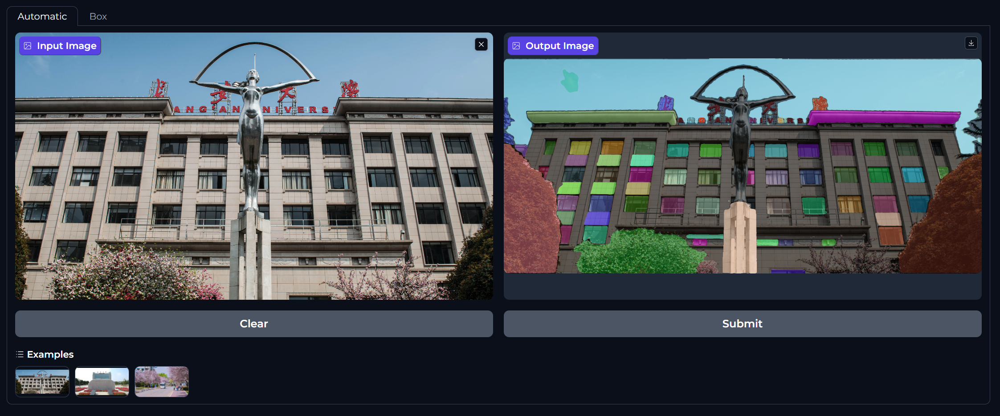
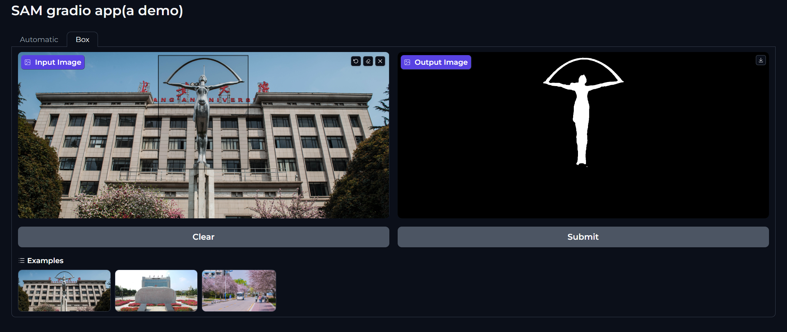

# NeuroSeg Pro

基于 LiteMedSAM 的专业医学图像交互式分割系统，提供 Gradio Web UI，支持 NIfTI 格式医学图像的点击式分割。

## 功能特性

- 支持 2D / 3D NIfTI 格式医学图像（.nii / .nii.gz）
- 交互式点击分割：点击病灶区域即可获取分割结果
- 3D 图像自动提取中间切片
- 实时 IoU 评估与病灶分析报告
- 支持 SAM 自动分割与 Prompt 分割（点/框）

## 界面预览




## 安装

### 1. 克隆仓库

```bash
git clone https://github.com/charlotte-12s/NeuroSeg-Pro.git
cd NeuroSeg-Pro
```

### 2. 安装 Segment Anything

```bash
cd segment-anything-main
pip install -e .
cd ..
```

### 3. 安装依赖

```bash
pip install -r requirements.txt
```

### 4. 下载模型权重

将 LiteMedSAM 权重文件放入 `weights/` 目录：

```bash
mkdir -p weights
# 将 medsam_lite_best.pth 放入 weights/ 目录
```

> 权重文件需自行获取，不包含在本仓库中。

## 使用

```bash
python app.py
```

启动后访问 `http://localhost:7860`。

### 操作步骤

1. 上传 NIfTI 图像文件（.nii.gz 或 .nii）
2. 系统自动预处理并显示图像
3. 在图像上点击目标区域
4. 查看分割结果（红色叠加区域）与分析报告

## 项目结构

```
NeuroSeg-Pro/
├── app.py                  # Gradio Web UI 主程序
├── inference.py            # MedSAM 推理逻辑
├── build_model.py          # 模型构建（MedSAM_Lite / MedSAM_Lite_scribble）
├── models/                 # 自定义模型组件
│   ├── ImageEncoder/       # 图像编码器（TinyViT / ViT）
│   ├── common/             # 公共组件（MaskDecoder, LoRA, Adapter）
│   ├── efficient_sam/      # EfficientSAM 实现
│   └── efficientvit/       # EfficientViT 实现
├── segment-anything-main/  # Segment Anything 官方代码
├── weights/                # 模型权重（需自行放置）
├── examples/               # 示例图像
└── test/                   # 界面截图
```

## 依赖

- Python >= 3.8
- PyTorch
- Gradio
- MONAI
- OpenCV
- NumPy

## 致谢

- [Segment Anything (SAM)](https://github.com/facebookresearch/segment-anything) - Meta AI
- [LiteMedSAM](https://github.com/bowang-lab/MedSAM) - MedSAM 团队
- [gradio-image-prompter](https://github.com/PhyscalX/gradio-image-prompter)

## License

Apache License 2.0
